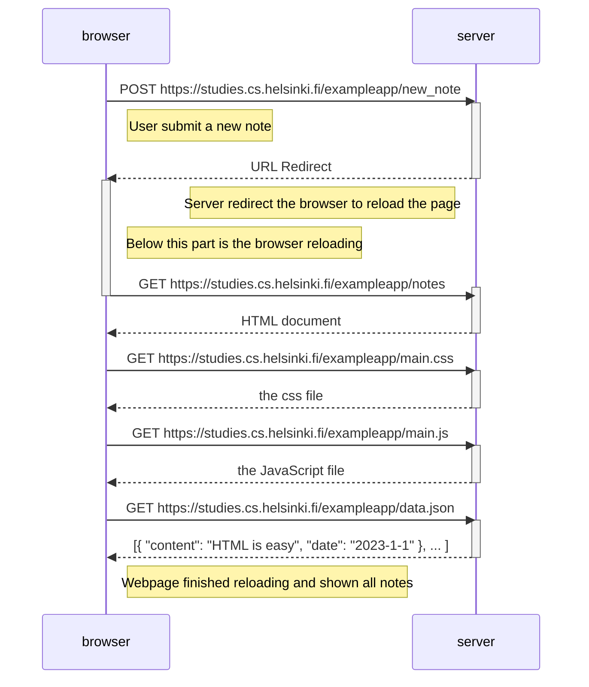

Diagram Where the user created a new note 

```mermaid
sequenceDiagram
    participant browser
    participant server

    browser->>server: POST https://studies.cs.helsinki.fi/exampleapp/new_note
    activate server
    note right of browser: User submit a new note
    server-->>browser: URL Redirect
    deactivate server
    activate browser
    note left of server: Server redirect the browser to reload the page
    note right of browser: Below this part is the browser reloading

    browser->>server: GET https://studies.cs.helsinki.fi/exampleapp/notes
    activate server
    
    deactivate browser
    server-->>browser: HTML document
    deactivate server

    browser->>server: GET https://studies.cs.helsinki.fi/exampleapp/main.css
    activate server
    server-->>browser: the css file
    deactivate server

    browser->>server: GET https://studies.cs.helsinki.fi/exampleapp/main.js
    activate server
    server-->>browser: the JavaScript file
    deactivate server


    browser->>server: GET https://studies.cs.helsinki.fi/exampleapp/data.json
    activate server
    server-->>browser: [{ "content": "HTML is easy", "date": "2023-1-1" }, ... ]
    deactivate server

    note right of browser: Webpage finished reloading and shown all notes

```